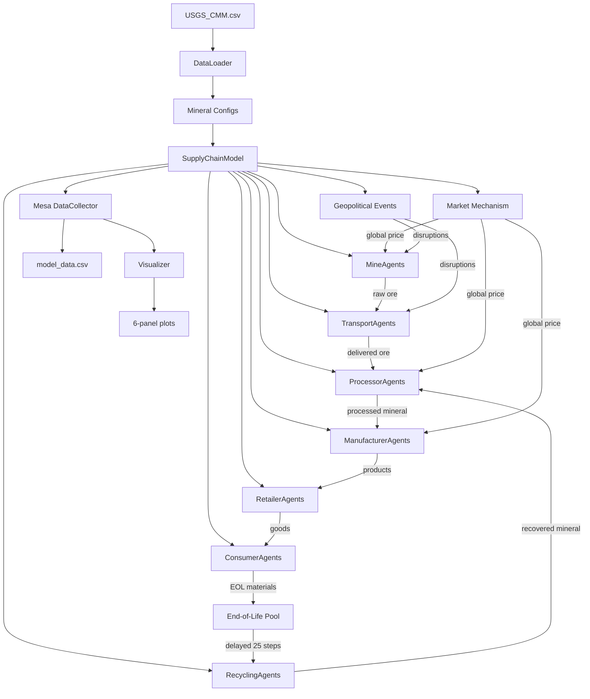

# Critical Minerals Supply Chain ABM - Architecture Plan

## Overview

This agent-based model simulates the global supply chain for critical minerals (Lithium, Nickel, Platinum) using real-world data from USGS. The model tracks material flow from mining through processing, manufacturing, retail, consumption, and recycling, with dynamic pricing, geopolitical disruptions, and substitution effects.

## Project Structure

```
pyExaMINE/
├── README.md
├── USGS_CMM.csv
├── requirements.txt
├── plans/
│   └── architecture_plan.md
├── src/
│   ├── __init__.py
│   ├── agents/
│   │   ├── __init__.py
│   │   ├── mine_agent.py
│   │   ├── processor_agent.py
│   │   ├── transport_agent.py
│   │   ├── manufacturer_agent.py
│   │   ├── retailer_agent.py
│   │   ├── consumer_agent.py
│   │   └── recycling_agent.py
│   ├── model/
│   │   ├── __init__.py
│   │   ├── supply_chain_model.py
│   │   └── market_mechanism.py
│   ├── data/
│   │   ├── __init__.py
│   │   └── data_loader.py
│   ├── visualization/
│   │   ├── __init__.py
│   │   └── visualizer.py
│   └── config/
│       ├── __init__.py
│       ├── lithium_config.py
│       ├── nickel_config.py
│       └── platinum_config.py
├── outputs/
│   └── (generated plots and data)
└── run_simulation.py
```

## Data Architecture

### USGS Data Integration

The model will extract country-level data for three minerals:

**For Lithium:**
- `Lithium_Production_2025`: Annual production (tons)
- `Lithium_Reserves`: Total reserves (tons)
- `Lithium_Num_Deposits`: Number of deposits
- `Lithium_Global_Demand_2024/2030/2050_NetZero`: Demand forecasts

**For Nickel:**
- `Nickel_Production_2025`: Annual production (tons)
- `Nickel_Reserves`: Total reserves (tons)
- `Nickel_Global_Demand_2024/2030/2050_NetZero`: Demand forecasts

**For Platinum:**
- `Platinum_Production_2025`: Annual production (tons)
- `Platinum_Reserves`: Total reserves (tons)
- `Platinum_Global_Demand_2024/2030/2050_NetZero`: Demand forecasts

### Derived Parameters

From the USGS data, we'll derive:
- **Ore Grade**: Calibrated based on reserve/production ratios
- **Extraction Cost**: Varies by jurisdiction (regional cost multipliers)
- **Production Capacity**: Based on current production levels
- **Initial Reserves**: Direct from USGS data
- **Market Share**: Percentage of global production

## Agent Architecture

### 1. MineAgent

**Purpose**: Produces raw minerals from reserves

**Attributes**:
```python
- unique_id: int
- mineral_type: str (lithium, nickel, platinum)
- jurisdiction: str (country name)
- ore_grade: float (0-1, derived from data)
- production_capacity: float (tons/step, from USGS)
- extraction_cost: float ($/ton, jurisdiction-based)
- reserves: float (tons, from USGS)
- operational: bool (True initially)
- disruption_counter: int (steps remaining in disruption)
```

**Behavior** (per step):
1. Check if operational (not disrupted)
2. Compare current market price to extraction_cost
3. If profitable and reserves > 0:
   - Produce min(production_capacity, reserves) * ore_grade
   - Deduct from reserves
   - Offer material to processors
4. Random disruption check (2% chance):
   - Set operational = False
   - disruption_counter = random(3, 5)
5. If disrupted, decrement counter and check if back online

**Key Decisions**:
- Shutdown if price < extraction_cost for extended period
- Restart if price > extraction_cost * 1.2

### 2. ProcessorAgent

**Purpose**: Converts raw ore to processed mineral

**Attributes**:
```python
- unique_id: int
- mineral_type: str
- conversion_efficiency: float (0-1, e.g., 0.7-0.9)
- energy_cost: float ($/ton processed)
- capacity: float (tons/step)
- inventory: float (tons of processed material)
- supplier_preferences: dict {mine_id: cost_score}
```

**Behavior** (per step):
1. Rank available mines by total_cost (extraction + transport)
2. Purchase ore from cheapest sources up to capacity
3. Convert ore: processed = ore * conversion_efficiency
4. Add to inventory
5. Sell to manufacturers based on orders
6. Update supplier_preferences based on reliability

**Market Interaction**:
- Posts available inventory to market
- Responds to manufacturer orders

### 3. TransportAgent

**Purpose**: Moves material between agents with delays

**Attributes**:
```python
- unique_id: int
- mode: str (ship, rail, truck)
- cost_per_unit: float ($/ton)
- lead_time: int (steps delay)
- capacity: float (tons/step)
- disruption_probability: float (0.01-0.05)
- in_transit: list of {material, quantity, origin, destination, arrival_step}
```

**Behavior** (per step):
1. Check for new disruptions (geopolitical events)
2. Process in_transit queue:
   - Deliver materials that have arrival_step == current_step
3. Accept new shipment requests
4. Calculate total cost = distance_factor * cost_per_unit

**Transport Modes**:
- Ship: Low cost (10 $/ton), long lead_time (5-8 steps)
- Rail: Medium cost (25 $/ton), medium lead_time (3-5 steps)
- Truck: High cost (50 $/ton), short lead_time (1-2 steps)

### 4. ManufacturerAgent

**Purpose**: Produces goods using processed minerals

**Attributes**:
```python
- unique_id: int
- mineral_type: str
- mineral_intensity: float (tons mineral/unit product)
- input_inventory: float (tons)
- production_capacity: float (units/step)
- substitution_investment: float (0-1, R&D progress)
- high_price_counter: int (consecutive steps with high prices)
- target_inventory: float (safety stock level)
```

**Behavior** (per step):
1. Check input_inventory vs target_inventory
2. If low, order from processors: order_qty = target - current
3. Produce goods: output = min(input_inventory / mineral_intensity, capacity)
4. Track price history:
   - If price > threshold for 10+ steps:
     - Increase substitution_investment by 0.01
     - Reduce mineral_intensity by (1 - 0.05 * substitution_investment)
5. Supply retailers based on orders

**Substitution Logic**:
- Threshold price varies by mineral (e.g., 150% of initial price)
- Max reduction in mineral_intensity: 30% over time
- Investment is gradual and irreversible

### 5. RetailerAgent

**Purpose**: Manages inventory and sells to consumers

**Attributes**:
```python
- unique_id: int
- inventory: float (product units)
- reorder_point: float (s parameter)
- order_quantity: float (Q parameter)
- lead_time: int (steps)
- pending_orders: list of {quantity, expected_arrival}
```

**Behavior** (per step):
1. Sell to consumers based on demand
2. Check inventory level
3. If inventory ≤ reorder_point and no pending_orders:
   - Place order for order_quantity to manufacturer
4. Receive pending orders that arrive this step
5. Track stockout events

**(s, Q) Policy**:
- s = mean_demand * lead_time + safety_stock
- Q = Economic Order Quantity or fixed batch size

### 6. ConsumerAgent

**Purpose**: Generates demand with price sensitivity

**Attributes**:
```python
- unique_id: int
- base_demand: float (units/step, from USGS demand forecast)
- price_sensitivity: float (-0.5 to -2.0, elasticity)
- demand_threshold_price: float (max acceptable price)
- fulfilled_demand: float (actual purchases)
- unfulfilled_demand: float (unmet demand)
```

**Behavior** (per step):
1. Calculate current_demand = base_demand * (1 + price_effect)
   - price_effect = price_sensitivity * ln(current_price / initial_price)
2. Attempt to purchase from retailers
3. Track fulfilled vs unfulfilled demand
4. Contribute to end_of_life_pool after lag period

**Demand Calibration**:
- Aggregate consumer base_demand = Global_Demand_2024 / n_steps_per_year
- Distribute across n_consumers agents

### 7. RecyclingFacilityAgent

**Purpose**: Recovers minerals from end-of-life products

**Attributes**:
```python
- unique_id: int
- collection_rate: float (0-1, % of EOL materials collected)
- recovery_efficiency: float (0-1, % recovered from collected)
- processing_cost: float ($/ton)
- storage: float (tons)
```

**Behavior** (per step):
1. Collect from global end_of_life_pool:
   - collected = end_of_life_pool[step - 25] * collection_rate
2. Process collected material:
   - recovered = collected * recovery_efficiency
3. If market_price * recovered > processing_cost * collected:
   - Sell recovered material to processors
   - Inject into processor inventory
4. Otherwise, store for later

**EOL Pool Mechanism**:
- Global queue: end_of_life_pool[step] = consumer_purchases[step]
- Delayed by 25 steps (product lifetime)
- Recyclers draw from step-25

## Market Mechanism

### Global Price Dynamics

**Price Update Logic** (each step):
```python
inventory_ratio = total_processor_inventory / average_demand
if inventory_ratio < 0.5:
    price *= 1.05  # Supply shortage
elif inventory_ratio > 1.5:
    price *= 0.95  # Oversupply
price = max(price_floor, min(price, price_ceiling))
```

**Price Bounds**:
- Floor: 40% of initial price
- Ceiling: 300% of initial price

**Market Clearing**:
- Processors post available inventory
- Manufacturers/Retailers bid based on urgency
- Transactions cleared at current global price

## Geopolitical Events

### Event System

**Probability**: 1% per step (configurable)

**Mechanism**:
1. Random selection of jurisdiction from active mining countries
2. Identify all mines and transport routes in/out of jurisdiction
3. Set disruption for 5-15 steps (random)
4. Affected mines: operational = False
5. Affected transport: block shipments involving jurisdiction

**Impact Tracking**:
- Count disrupted mines per step
- Track supply shortfall
- Monitor price spike magnitude

**Geographic Risk**:
- High-concentration jurisdictions (e.g., Congo for Cobalt) have higher systemic risk
- Model can assign region-specific probabilities

## Data Collection

### Mesa DataCollector Configuration

**Model-level reporters**:
```python
{
    "Global_Price": lambda m: m.current_price,
    "Total_Processor_Inventory": lambda m: sum(a.inventory for a in m.processors),
    "Total_Mine_Output": lambda m: sum(a.production_this_step for a in m.mines),
    "Total_Recycled_Supply": lambda m: sum(a.recycled_this_step for a in m.recyclers),
    "Disrupted_Mines_Count": lambda m: sum(not a.operational for a in m.mines),
    "Total_Consumer_Demand": lambda m: sum(a.current_demand for a in m.consumers),
    "Fulfilled_Demand": lambda m: sum(a.fulfilled_demand for a in m.consumers),
    "Unfulfilled_Demand": lambda m: sum(a.unfulfilled_demand for a in m.consumers),
    "Avg_Manufacturer_Intensity": lambda m: sum(a.mineral_intensity for a in m.manufacturers) / len(m.manufacturers),
}
```

**Agent-level reporters** (optional):
- Individual mine production
- Processor inventory levels
- Manufacturer substitution investment

## Visualization Design

### 2x3 Subplot Layout

**Figure Configuration**:
- Size: 15" x 10"
- Tight layout with shared time axis (x)

**Subplots**:

1. **[0,0] Mineral Price Over Time**
   - Y-axis: Price ($/ton)
   - Line plot with price_floor and price_ceiling as horizontal dashes
   - Highlight geopolitical event periods with vertical shaded regions

2. **[0,1] Total Processor Inventory Over Time**
   - Y-axis: Inventory (tons)
   - Stacked area or line plot
   - Reference line for "healthy inventory" threshold

3. **[0,2] Mine Output vs. Recycled Supply**
   - Y-axis: Production (tons/step)
   - Two lines: mine_output (solid), recycled_supply (dashed)
   - Show growing contribution of recycling over time

4. **[1,0] Fulfilled vs. Unfulfilled Demand**
   - Y-axis: Demand (tons/step)
   - Stacked area: fulfilled (green), unfulfilled (red)
   - Shows market tightness

5. **[1,1] Number of Disrupted Mines**
   - Y-axis: Count of mines offline
   - Step plot or bar chart
   - Correlates with price spikes

6. **[1,2] Manufacturer Mineral Intensity**
   - Y-axis: Tons mineral per unit product
   - Line showing average mineral_intensity
   - Demonstrates substitution effect during high prices

**Styling**:
- Color scheme: Blues for supply-side, Greens/Reds for demand
- Grid: Light gray, alpha=0.3
- Legends: Upper right, small font
- Title: Include mineral type and key parameters

## Configuration Files

### Mineral-Specific Parameters

Each mineral (Lithium, Nickel, Platinum) has unique characteristics:

**Lithium Configuration**:
```python
LITHIUM_CONFIG = {
    "mineral_type": "Lithium",
    "initial_price": 17000,  # $/ton (2024 avg)
    "price_floor": 6800,
    "price_ceiling": 51000,
    
    # Agent counts
    "n_mines": "auto",  # From USGS: countries with production > 0
    "n_processors": 5,
    "n_manufacturers": 8,
    "n_retailers": 12,
    "n_consumers": 100,
    "n_recyclers": 3,
    
    # Production parameters
    "avg_ore_grade": 0.85,
    "processor_conversion_efficiency": 0.80,
    "manufacturer_mineral_intensity": 0.08,  # tons Li per EV
    
    # Economic parameters
    "base_extraction_cost": 8000,  # $/ton
    "energy_cost_factor": 0.15,
    
    # Recycling parameters
    "collection_rate": 0.30,  # 30% of EOL collected
    "recovery_efficiency": 0.70,  # 70% recovered
    "product_lifetime_steps": 25,
    
    # Market parameters
    "geopolitical_event_probability": 0.01,
    "disruption_probability": 0.02,
    
    # Simulation parameters
    "n_steps": 200,
    "random_seed": 42
}
```

**Nickel Configuration**:
```python
NICKEL_CONFIG = {
    "mineral_type": "Nickel",
    "initial_price": 18000,  # $/ton
    "price_floor": 7200,
    "price_ceiling": 54000,
    # ... adjusted for Nickel characteristics
    "avg_ore_grade": 0.65,  # Lower than Li
    "manufacturer_mineral_intensity": 0.04,  # tons Ni per EV
    "collection_rate": 0.60,  # Higher recycling rate (established)
    # ...
}
```

**Platinum Configuration**:
```python
PLATINUM_CONFIG = {
    "mineral_type": "Platinum",
    "initial_price": 30000000,  # $/ton ($/oz * 32150)
    "price_floor": 12000000,
    "price_ceiling": 90000000,
    # ... adjusted for Platinum (precious metal)
    "avg_ore_grade": 0.55,  # Very low grade
    "manufacturer_mineral_intensity": 0.00005,  # grams per catalyst
    "n_mines": "auto",  # Very concentrated: SA, Russia
    # ...
}
```

## Data Flow Diagram



## Implementation Sequence

### Phase 1: Foundation (Steps 1-5)
1. Setup project structure and requirements.txt
2. Implement data_loader.py to parse USGS_CMM.csv
3. Create base agent classes with Mesa Agent inheritance
4. Implement market_mechanism.py for price dynamics
5. Create configuration files with calibrated parameters

### Phase 2: Agent Implementation (Steps 6-13)
6. Implement MineAgent with USGS-derived attributes
7. Implement ProcessorAgent with inventory management
8. Implement TransportAgent with delay queue
9. Implement ManufacturerAgent with substitution logic
10. Implement RetailerAgent with (s,Q) policy
11. Implement ConsumerAgent with demand curves
12. Implement RecyclingAgent with EOL pool
13. Add geopolitical event system to model

### Phase 3: Model Assembly (Steps 14-17)
14. Create SupplyChainModel with Mesa Model class
15. Configure agent scheduling (Mesa RandomActivation)
16. Setup DataCollector with all reporters
17. Implement step() method with market clearing

### Phase 4: Visualization & Testing (Steps 18-20)
18. Create visualizer.py with 6-panel layout
19. Build run_simulation.py to execute scenarios
20. Test and validate with all three minerals

## Key Technical Decisions

### Mesa 2.x Syntax
- Use `mesa.Model` and `mesa.Agent` base classes
- Use `mesa.time.RandomActivation` for scheduling
- Use `mesa.datacollection.DataCollector` for metrics
- Mesa 2.x doesn't require explicit space (no grid needed)

### Performance Considerations
- Keep agent counts reasonable (total < 500 agents)
- Use numpy for batch calculations where possible
- Cache expensive lookups (transport costs, supplier rankings)

### Validation Approach
- Compare aggregate supply/demand to USGS forecasts
- Check price stability in baseline (no shocks)
- Verify recycling contribution reaches 10-20% by end
- Ensure substitution reduces intensity by 20-30% under sustained high prices

## Success Criteria

The model is successful when it demonstrates:

1. **Realistic Dynamics**:
   - Price responds to supply shocks
   - Inventory buffers smooth demand
   - Recycling grows over time

2. **Behavioral Fidelity**:
   - Mines shut down when unprofitable
   - Manufacturers invest in substitution under price pressure
   - Consumers reduce demand at high prices

3. **Scenario Responsiveness**:
   - Geopolitical events cause price spikes
   - Transport disruptions create regional shortages
   - Recycling partially offsets primary supply

4. **Data-Driven Calibration**:
   - Initial conditions match USGS 2025 production
   - Demand growth aligns with NetZero scenarios
   - Country-level production shares reflect reality

## Next Steps

After this plan is approved:

1. Create detailed class diagrams for each agent
2. Define exact equations for price updates and demand curves
3. Calibrate regional cost multipliers from literature
4. Implement and test each module incrementally
5. Run sensitivity analysis on key parameters

---

**Document Version**: 1.0  
**Last Updated**: 2026-05-01  
**Status**: Ready for Review
